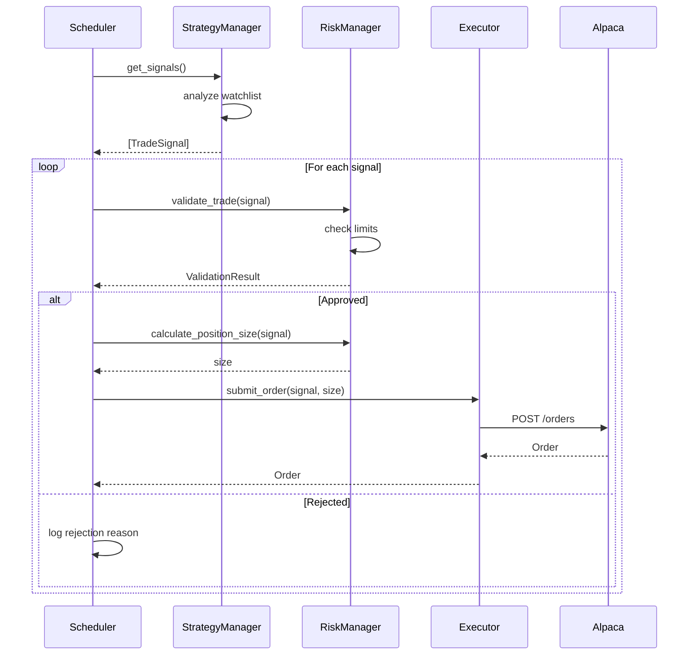
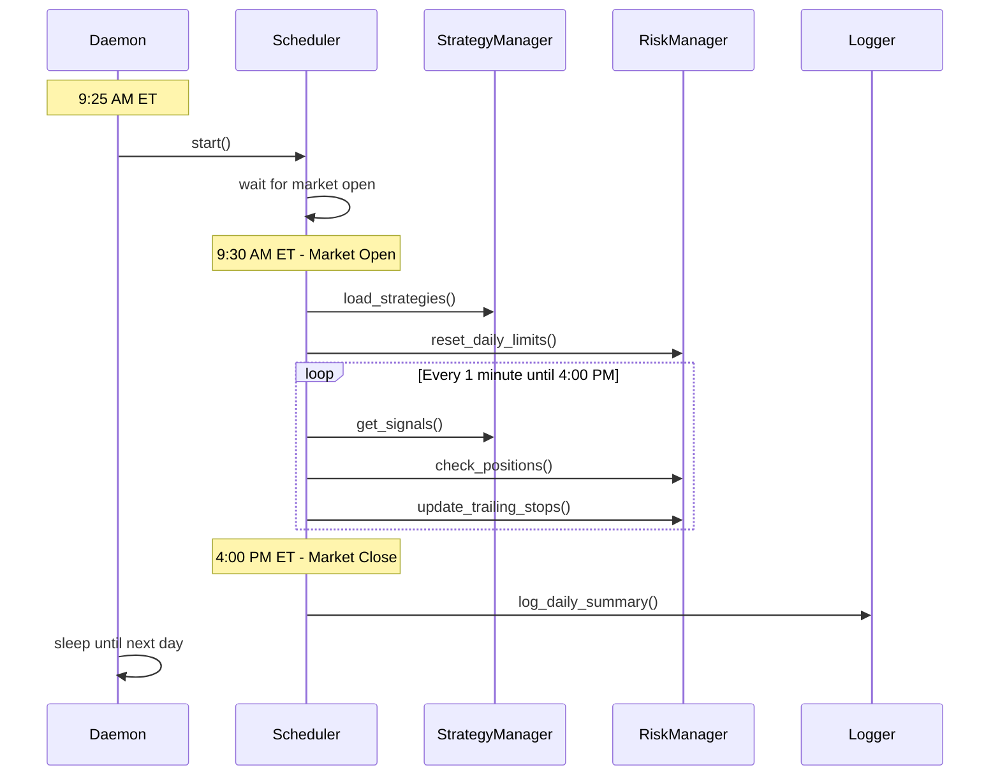

# Alpaca Trading System - Design

## Architecture Overview

```
┌─────────────────────────────────────────────────────────────────────────────┐
│                              JARVIS (Agent)                                  │
│  • Cron check-ins (3x daily)                                                │
│  • Strategy optimization                                                     │
│  • Performance analysis                                                      │
│  • Config updates                                                            │
└─────────────────────────────────────────────────────────────────────────────┘
                                      │
                    reads/writes config + logs
                                      ▼
┌─────────────────────────────────────────────────────────────────────────────┐
│                         TRADING ENGINE (Python)                              │
│                                                                              │
│  ┌──────────────┐  ┌──────────────┐  ┌──────────────┐  ┌──────────────┐    │
│  │   Scheduler  │  │   Strategy   │  │    Risk      │  │   Executor   │    │
│  │   (APScheduler)│ │   Manager    │  │   Manager    │  │   (Orders)   │    │
│  └──────────────┘  └──────────────┘  └──────────────┘  └──────────────┘    │
│         │                  │                 │                 │            │
│         └──────────────────┴─────────────────┴─────────────────┘            │
│                                      │                                       │
│                           ┌──────────┴──────────┐                           │
│                           │   Alpaca Client     │                           │
│                           │   (alpaca-py SDK)   │                           │
│                           └─────────────────────┘                           │
└─────────────────────────────────────────────────────────────────────────────┘
                                      │
                               REST API + WebSocket
                                      ▼
┌─────────────────────────────────────────────────────────────────────────────┐
│                            ALPACA (Live)                                     │
│                       https://api.alpaca.markets                             │
└─────────────────────────────────────────────────────────────────────────────┘
```

---

## Component Design

### 1. Scheduler (`scheduler.py`)
**Responsibility:** Orchestrate trading sessions based on market hours.

```python
class TradingScheduler:
    def start() -> None
    def stop() -> None
    def is_market_open() -> bool
    def schedule_market_open_tasks() -> None
    def schedule_market_close_tasks() -> None
```

**Events:**
- `on_market_open`: Initialize strategies, check positions
- `on_market_close`: Generate daily report, log summary
- `on_interval` (every 1 min): Check for trade signals

---

### 2. Strategy Manager (`strategy_manager.py`)
**Responsibility:** Load, manage, and execute trading strategies.

```python
class StrategyManager:
    def load_strategies(config_path: Path) -> None
    def reload_config() -> None
    def get_signals() -> List[TradeSignal]
    def get_active_strategies() -> List[Strategy]

@dataclass
class TradeSignal:
    symbol: str
    side: Literal["buy", "sell"]
    strategy_name: str
    confidence: float  # 0.0 - 1.0
    entry_price: Optional[float]
    stop_loss: Optional[float]
    take_profit: Optional[float]
```

**Strategy Interface:**
```python
class Strategy(Protocol):
    name: str
    enabled: bool
    
    def analyze(self, symbol: str, bars: pd.DataFrame) -> Optional[TradeSignal]
    def get_watchlist(self) -> List[str]
```

---

### 3. Risk Manager (`risk_manager.py`)
**Responsibility:** Validate trades against risk limits, manage stops.

```python
class RiskManager:
    def validate_trade(signal: TradeSignal, account: Account) -> ValidationResult
    def calculate_position_size(signal: TradeSignal, account: Account) -> float
    def check_daily_limits() -> bool
    def update_trailing_stops(positions: List[Position]) -> None
    def should_halt_trading() -> bool

@dataclass
class ValidationResult:
    approved: bool
    reason: Optional[str]
    adjusted_size: Optional[float]

@dataclass
class RiskConfig:
    max_position_pct: float = 0.10  # 10% of portfolio
    max_daily_loss_pct: float = 0.02  # 2% of portfolio
    max_positions: int = 5
    stop_loss_pct: float = 0.015  # 1.5%
    take_profit_pct: float = 0.02  # 2%
    trailing_stop_activation: float = 0.02  # Activate at 2% profit
```

---

### 4. Executor (`executor.py`)
**Responsibility:** Submit and manage orders via Alpaca API.

```python
class OrderExecutor:
    def submit_order(signal: TradeSignal, size: float) -> Order
    def cancel_order(order_id: str) -> bool
    def get_positions() -> List[Position]
    def close_position(symbol: str) -> Order
    def close_all_positions() -> List[Order]
```

---

### 5. Alpaca Client (`alpaca_client.py`)
**Responsibility:** Wrapper around Alpaca SDK with credential management.

```python
class AlpacaClient:
    def __init__(self):
        # Load credentials from 1Password at runtime
        self.api_key = self._get_credential("API Key")
        self.api_secret = self._get_credential("API Secret")
        self.client = TradingClient(self.api_key, self.api_secret)
    
    def get_account() -> Account
    def get_positions() -> List[Position]
    def get_bars(symbol: str, timeframe: str, limit: int) -> pd.DataFrame
    def submit_order(order_request: OrderRequest) -> Order
    def get_clock() -> Clock
```

---

### 6. Logger (`logger.py`)
**Responsibility:** Structured logging to JSON files.

```python
class TradingLogger:
    def log_trade(trade: Trade) -> None
    def log_signal(signal: TradeSignal, action: str) -> None
    def log_error(error: Exception, context: dict) -> None
    def log_daily_summary(summary: DailySummary) -> None
```

**Log Format:**
```json
{
  "timestamp": "2026-02-02T15:30:00Z",
  "level": "INFO",
  "event": "trade_executed",
  "data": {
    "symbol": "AAPL",
    "side": "buy",
    "qty": 0.5,
    "price": 185.50,
    "strategy": "momentum_breakout"
  }
}
```

---

## Data Models

### Configuration (`config/strategy.json`)
```json
{
  "risk": {
    "max_position_pct": 0.10,
    "max_daily_loss_pct": 0.02,
    "max_positions": 5,
    "stop_loss_pct": 0.015
  },
  "strategies": {
    "momentum_breakout": {
      "enabled": true,
      "watchlist": ["SPY", "QQQ", "AAPL", "MSFT", "NVDA"],
      "params": {
        "vwap_buffer": 0.001,
        "volume_threshold": 1.5,
        "min_price": 10,
        "max_price": 500
      }
    },
    "mean_reversion": {
      "enabled": true,
      "watchlist": ["SPY", "QQQ"],
      "params": {
        "rsi_oversold": 30,
        "rsi_overbought": 70,
        "lookback_period": 14
      }
    }
  }
}
```

### Trade Record (SQLite)
```sql
CREATE TABLE trades (
    id INTEGER PRIMARY KEY AUTOINCREMENT,
    timestamp TEXT NOT NULL,
    symbol TEXT NOT NULL,
    side TEXT NOT NULL,
    qty REAL NOT NULL,
    entry_price REAL NOT NULL,
    exit_price REAL,
    pnl REAL,
    strategy TEXT NOT NULL,
    status TEXT NOT NULL,
    order_id TEXT
);
```

---

## File Structure

```
projects/alpaca-trading/
├── README.md
├── requirements.md
├── design.md
├── tasks.md
├── pyproject.toml
├── src/
│   ├── __init__.py
│   ├── main.py              # Entry point
│   ├── scheduler.py         # Market hours orchestration
│   ├── strategy_manager.py  # Strategy loading/execution
│   ├── risk_manager.py      # Risk controls
│   ├── executor.py          # Order management
│   ├── alpaca_client.py     # Alpaca API wrapper
│   ├── logger.py            # Structured logging
│   ├── models.py            # Data classes
│   └── strategies/
│       ├── __init__.py
│       ├── base.py          # Strategy protocol
│       ├── momentum.py      # Momentum breakout
│       └── mean_reversion.py
├── config/
│   ├── strategy.json        # Strategy parameters
│   └── daemon.plist         # launchd config
├── data/
│   └── trades.db            # SQLite database
└── logs/
    └── YYYY-MM-DD.jsonl     # Daily log files
```

---

## Sequence Diagrams

### Trade Execution Flow


### Daily Lifecycle


---

## Integration Points

### Agent Interface

**Status Check (read-only):**
```bash
# Get current status
cat ~/.openclaw/workspace/projects/alpaca-trading/logs/status.json
```

```json
{
  "timestamp": "2026-02-02T15:30:00Z",
  "account": {
    "portfolio_value": 467.00,
    "cash": 50.00,
    "buying_power": 50.00
  },
  "daily_pnl": 4.62,
  "daily_pnl_pct": 1.0,
  "positions": [
    {"symbol": "AAPL", "qty": 0.5, "unrealized_pnl": 2.50}
  ],
  "trades_today": 3,
  "strategies_active": ["momentum_breakout", "mean_reversion"]
}
```

**Config Update (write):**
Agent modifies `config/strategy.json`, system reloads within 60s.

---

## Deployment

### launchd Configuration (`config/daemon.plist`)
```xml
<?xml version="1.0" encoding="UTF-8"?>
<!DOCTYPE plist PUBLIC "-//Apple//DTD PLIST 1.0//EN" 
  "http://www.apple.com/DTDs/PropertyList-1.0.dtd">
<plist version="1.0">
<dict>
    <key>Label</key>
    <string>com.openclaw.alpaca-trader</string>
    <key>ProgramArguments</key>
    <array>
        <string>/usr/bin/env</string>
        <string>python3</string>
        <string>/Users/raythomas/.openclaw/workspace/projects/alpaca-trading/src/main.py</string>
    </array>
    <key>RunAtLoad</key>
    <true/>
    <key>KeepAlive</key>
    <true/>
    <key>StandardOutPath</key>
    <string>/Users/raythomas/.openclaw/workspace/projects/alpaca-trading/logs/stdout.log</string>
    <key>StandardErrorPath</key>
    <string>/Users/raythomas/.openclaw/workspace/projects/alpaca-trading/logs/stderr.log</string>
    <key>EnvironmentVariables</key>
    <dict>
        <key>PATH</key>
        <string>/opt/homebrew/bin:/usr/local/bin:/usr/bin:/bin</string>
    </dict>
</dict>
</plist>
```

**Install:**
```bash
cp config/daemon.plist ~/Library/LaunchAgents/com.openclaw.alpaca-trader.plist
launchctl load ~/Library/LaunchAgents/com.openclaw.alpaca-trader.plist
```

---

## Dependencies

```toml
[project]
name = "alpaca-trader"
version = "0.1.0"
requires-python = ">=3.11"
dependencies = [
    "alpaca-py>=0.30.0",
    "pandas>=2.0.0",
    "apscheduler>=3.10.0",
    "ta>=0.11.0",  # Technical analysis
]

[project.optional-dependencies]
dev = ["pytest", "ruff", "mypy"]
```
